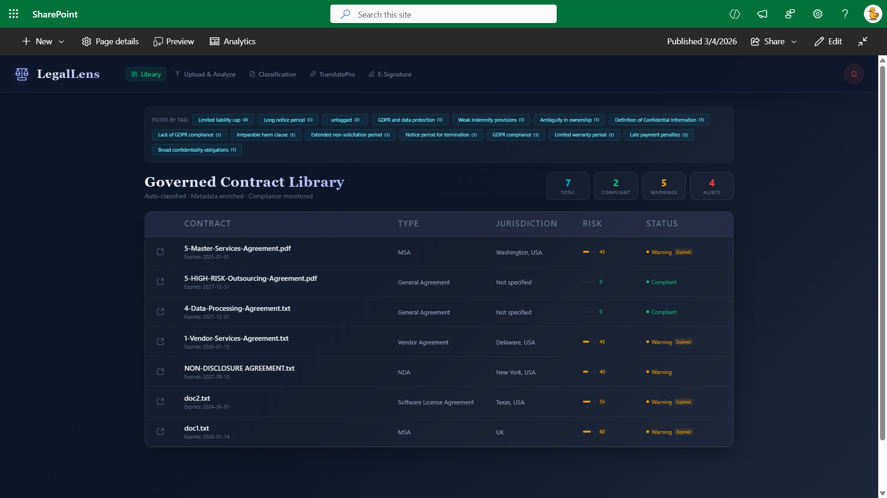
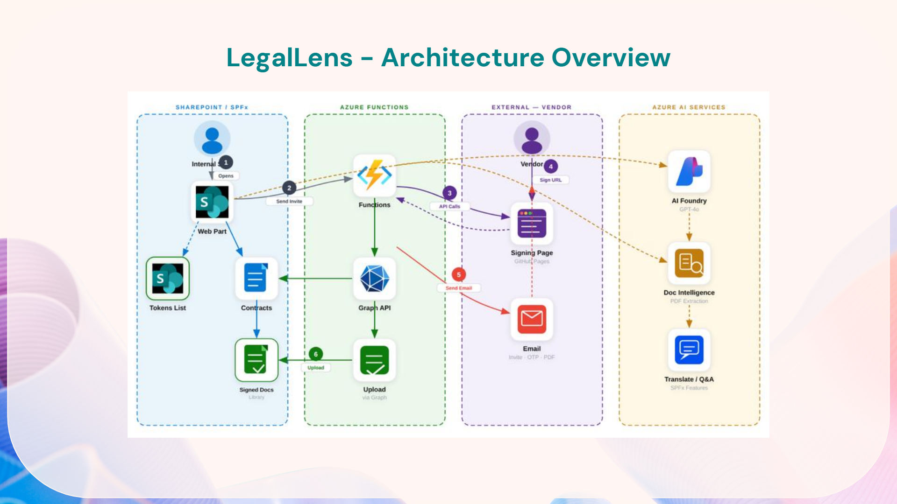
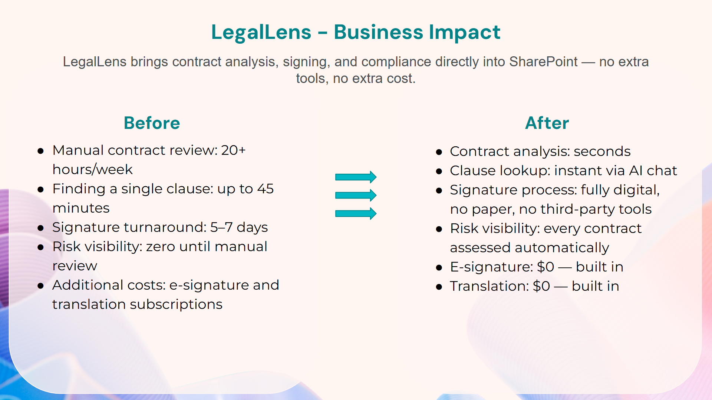

# LegalLens — SharePoint-Integrated AI Assistant for Legal Teams

LegalLens is a SharePoint Framework web part that brings AI-powered contract analysis directly into SharePoint. Legal teams can upload, analyze, classify, and sign contracts without leaving their SharePoint environment.

Built with SPFx (React, TypeScript, Fluent UI), Azure Functions, Azure AI Foundry (GPT-4), and Azure Document Intelligence.

### Demo Video

[Watch the full demo](placeholder-video-link)

## Features

- **Library:** Contract overview with risk levels, status, duplicate detection, and dangerous clause flagging. Document-specific AI chat with citations.
- **Upload & Analyze:** Upload contracts in any format (PDF, Word, scanned images). Azure Document Intelligence extracts text, GPT-4 segments clauses, evaluates risk patterns, checks for duplicates, and enriches SharePoint metadata.
- **Classification:** Targeted assessments: contract type classification, risk assessment, compliance checks (GDPR, CCPA, SOC 2), and entity extraction (parties, dates, obligations).
- **TranslatePro:** Multilingual AI chatbot. Users ask questions about contracts in any configured language and get responses with citations. Languages are configurable in web part properties.
- **E-Signature:** Built-in digital signing with draw/type options. External vendors sign via secure token-based URL — no SharePoint login needed. Mobile-responsive. Full audit trail (timestamp, IP, device). Signed documents stored back to SharePoint automatically.
- **Alerts:** Monitors contract library for high-risk scores and duplicates. Compiled into a single actionable list.

## Architecture

- **Frontend:** SPFx with React, TypeScript, and Fluent UI
- **Backend:** Serverless Azure Functions — handles authentication, email notifications, and webhooks
- **AI:** Azure AI Foundry (GPT-4) for risk assessment, classification, and multilingual understanding + Azure Document Intelligence for text extraction from any format
- **Data:** Everything stays within your Microsoft 365 tenant. AI processing happens in your Azure subscription. Data stays in your geographic region. Inherits SharePoint permissions. Complete audit trail.

## Business Impact

LegalLens replaces several manual processes and third-party tools. Contract analysis that previously took hours happens in seconds. Clause lookup is instant via AI chat. The built-in e-signature removes the need for separate signing subscriptions, and multilingual chat replaces external translation services. Everything runs on infrastructure the organization already has, no additional licensing costs.

## Configuration

For setup and configuration details, see the [README](https://github.com/saiiiiiii/LegalLens/blob/main/README.md).